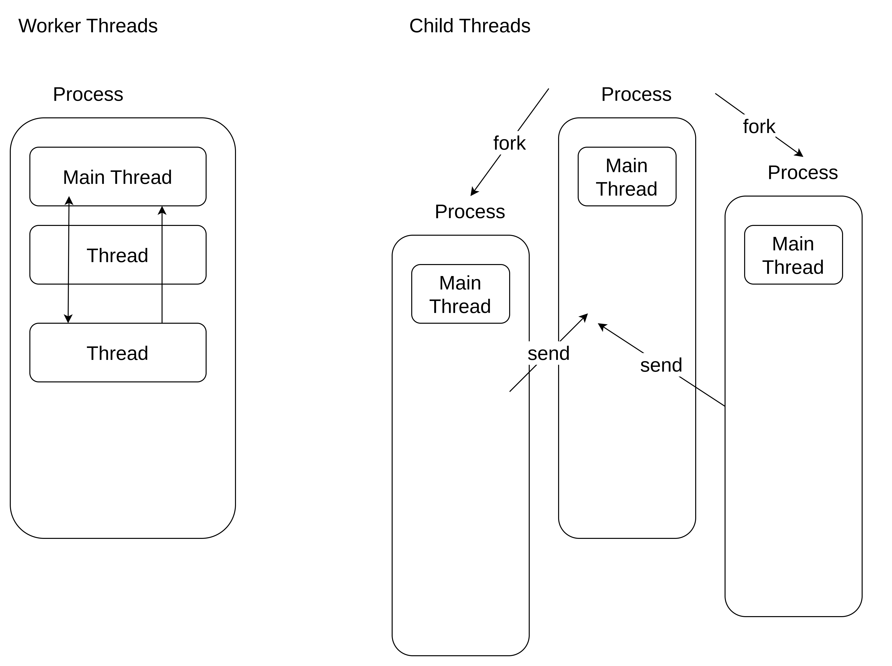

# nodejs worker thread vs child process

* Use Case:
  Choose child processes when you need complete isolation or want to utilize external processes. Choose worker threads for parallel computation within a single process.

* Resource Utilization:
  Child processes typically have higher resource overhead compared to worker threads dude to process creation and management.

* Complexity:
  Child processes are simpler to implement and manage compared to worker threads, which required careful handling shared memory of synchronization.